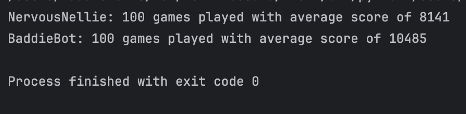

# LAB - Class 07, 08, 09 
## Project: Ten Thousand Dice Game in Terminal
### Author: Maddie Amelia Lewis

### Versions
Current: Version 4.0

### Links and Resources

Game online: http://www.playonlinedicegames.com/farkle
Rules of the game: https://en.wikipedia.org/wiki/Dice_10000
This is version of the game where you can only bank points once per round, and score is calculated as soon as the dice are set aside.

### Setup

python3 -m ten_thousand.game

Currently, the game will play 20 rounds. You can adjust this in your own code if you wish, it is located in the `start_game` method in ten_thousand.game.py. 

### Tests

**How do you run tests?**

When you run the main on game.py, you can customize if you are using the MockRoller class or not to simulate test rolls.
When running a particular simulation using the MockRoller class, you can modify the main to run first welcome with the optional parameters changed. If `sim=True` and `sim_number != 0`, then it will create an instance of MockRoller to work in tandem with a new game instance. 

To run the bot:
python3 -m ten_thousand.bot

**Any tests of note?**

I tested it with my bot and personally, and ran tests for each part. 
I had to refactor a lot of the given code for the bot lab-- it wasn't reading things properly. It took me a lot longer to do this assignment because I had to debug the beginning code :) 

**Describe any tests that you did not complete, skipped, etc**

I did not create a function test for validate_keepers on the assignment, because I already created a method that accomplishes a similar objective : `create_tuple()` method in the `GameLogic` class.
